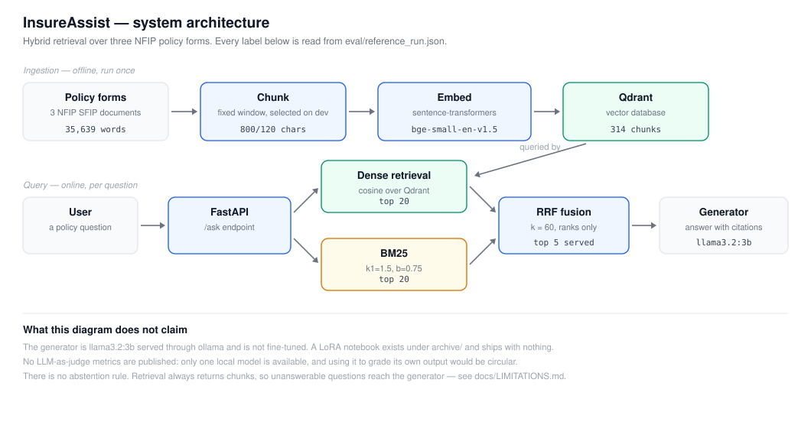

# InsureAssist


**A retrieval-augmented question-answering service for insurance policy documents, built as
an end-to-end engineering exercise: ingestion, vector search, a served API, a container, an
evaluation harness, and Kubernetes manifests.**

Ask a question in plain English (*"Does my home policy cover a burst pipe?"*) and the
service retrieves the most similar policy passages and answers from them, returning the
documents it drew on.

> **Read this before the feature list.** The sample corpus is two short synthetic policy
> documents that produce **7 chunks in total**. That is enough to demonstrate the pipeline
> and to test it. It is far too small to measure retrieval quality, so this repository
> publishes **no retrieval metrics**. What is and is not evidenced is set out in
> [Honest status](#honest-status) below.

---

## Architecture



Embed the question, find the most similar policy chunks in **Qdrant**, hand those chunks to
a local **LLM**, return the answer with its source documents. Documents are embedded and
stored ahead of time by a separate ingestion step.

---

## What's inside

- **Retrieval-augmented generation** — FastAPI service, Qdrant vector search, BGE
  embeddings, generation through a local Ollama model (`llama3.2:3b`).
- **An answer-quality harness** — a local **LLM-as-judge** that scores faithfulness,
  answer relevancy and correctness. These are custom judge metrics, *not* RAGAS metrics,
  and they do not measure retrieval. See [`eval/README.md`](eval/README.md).
- **A LoRA fine-tuning notebook** — a Colab recipe adapting Phi-3-mini with PEFT and
  logging to MLflow. **Authored, not evidenced**: no adapter, no run data, and no evidence
  it completed. The served system does not use a fine-tuned model.
- **Container and orchestration assets** — a **Dockerfile**, and **Kubernetes** manifests
  (Deployment, Service, ConfigMap, HPA) plus a **GKE** deployment guide. The manifests and
  the guide are **authored, not deployed** — neither has been verified against a cluster.
- **CI** — a GitHub Actions workflow running **lint and static validation only**.

---

## Honest status

The table below is the authoritative statement of what exists. Where something is authored
but unproven, it says so.

| Component | State | Evidence |
|---|---|---|
| RAG pipeline (FastAPI + Qdrant + BGE + Ollama) | **Working** | `src/`, runs locally |
| Offline unit + API failure-path tests | **Working** | `tests/`, run in CI |
| Answer-quality judge harness | **Working, weak** | `eval/eval_report.csv`; self-judging 3B model, 10 questions, single run |
| Retrieval quality | **Not measured** | No relevance labels exist; corpus too small to be meaningful |
| LoRA fine-tuning + MLflow | **Authored, not evidenced** | Notebook has no outputs; no adapter; no run data |
| Docker image | **Builds and runs locally** | Manual verification only — not built or tested in CI |
| Kubernetes manifests | **Authored, not deployed** | YAML parses in CI; never applied to a cluster |
| GKE deployment | **Guide only** | [`docs/gcp_deploy.md`](docs/gcp_deploy.md); deploy workflow has never succeeded |
| CI | **Lint and static checks + offline tests** | [`ci.yml`](.github/workflows/ci.yml) |
| Deploy workflow | **Unproven** | Requires unset GCP secrets; both historical runs failed |

### Known limitations

- **Retrieval is not evaluated.** `data/qa_testset.jsonl` holds reference answers but no
  relevant-document or chunk labels, so Recall@k, MRR and nDCG cannot be computed. There is
  no lexical baseline to compare against.
- **The corpus is 7 chunks and `TOP_K=4`**, so more than half the index is returned for
  every query. Retrieval is close to trivial at this scale.
- **The evaluation judge is the model being judged**, which biases the scores.
- **The fine-tuning data is the evaluation set.** The ten training pairs in the notebook
  are the ten test questions. No fine-tuned model can be honestly scored against them —
  see [`finetune/README.md`](finetune/README.md).
- **`sources` are document names, not citations.** There is no chunk-level or span-level
  attribution yet, so citation correctness cannot be checked.
- **The service cannot abstain reliably.** The prompt asks the model to say when it does
  not know, but nothing enforces it and there is no evidence threshold.
- **`/health` is liveness only.** It reports nothing about Qdrant or the generator, so a
  pod can pass it and still be unable to answer. The Kubernetes manifests currently use it
  for readiness too, which is wrong and tracked.
- **The container runs as root**, has no `HEALTHCHECK`, and installs unpinned dependencies,
  so images are not reproducible.

---

## Quickstart (about 10 minutes)

```bash
python -m venv .venv && .venv\Scripts\Activate.ps1     # Windows PowerShell
pip install -r requirements.txt
copy .env.example .env

docker compose up -d qdrant        # vector database on host port 6533
ollama pull llama3.2:3b            # local LLM for generation
python -m src.ingest               # documents -> embeddings -> Qdrant
uvicorn src.api:app --reload       # API at http://localhost:8000/docs
```

Then open http://localhost:8000/docs and try `/ask`:

```text
Q: Does home insurance cover water damage from a burst pipe?
A: Yes - sudden and accidental water damage from a burst pipe is covered, including the
   cost of tracing and accessing the leak. Gradual leakage or wear and tear is not covered.
   sources: home_insurance_policy.md (0.87), home_insurance_policy.md (0.70), ...
```

Answers vary between runs: generation uses the Ollama default temperature.

Phase-by-phase build notes are in [`ROADMAP.md`](ROADMAP.md); a walkthrough of every file is
in [`docs/PROJECT_EXPLAINED.md`](docs/PROJECT_EXPLAINED.md).

## Tests

```bash
pip install -r requirements-dev.txt
pytest
```

Every test is offline. Nothing downloads a model, contacts Qdrant, or needs Ollama —
`import src.api` performs no model loading or network access, which is what makes that
possible. See [`tests/README.md`](tests/README.md).

---

## Project structure

```
insureassist-rag-mlops/
├── src/                    # RAG service
│   ├── api.py              #   FastAPI app (/ask, /health)
│   ├── rag.py              #   retrieve + generate
│   ├── ingest.py           #   documents -> embeddings -> Qdrant
│   ├── providers.py        #   lazy, injectable embedder / vector store / generator
│   ├── errors.py           #   dependency failures -> 503
│   ├── hf_generator.py     #   optional Hugging Face backend (needs its own deps)
│   └── config.py           #   settings from .env
├── tests/                  # offline unit + API tests
├── finetune/               # LoRA notebook (authored, not evidenced)
├── eval/                   # LLM-as-judge harness + recorded report
├── k8s/                    # Kubernetes manifests (authored, not deployed)
├── data/                   # synthetic policies + Q&A set + provenance
├── docs/                   # diagrams, walkthrough, GCP guide
├── .github/workflows/      # CI and deploy pipelines
├── Dockerfile
├── docker-compose.yml      # local Qdrant
└── requirements.txt
```

---

## Tech stack

| Area | Tools |
|---|---|
| RAG | Qdrant (vector DB), sentence-transformers (BGE), FastAPI |
| Generation | Ollama (`llama3.2:3b`) |
| Evaluation | Custom LLM-as-judge metrics |
| Fine-tuning (notebook only) | Hugging Face Transformers, PEFT (LoRA), MLflow |
| Packaging & ops | Docker, Kubernetes manifests, GitHub Actions |
| Cloud (guide only) | Google Cloud — GKE, Artifact Registry |

`torch`, `transformers` and `peft` are used only by the optional `hf` backend and the Colab
notebook. They are not installed by `requirements.txt`.

---

## License

Released under the [MIT License](LICENSE). The sample data is synthetic and self-authored —
see [`data/README.md`](data/README.md).
