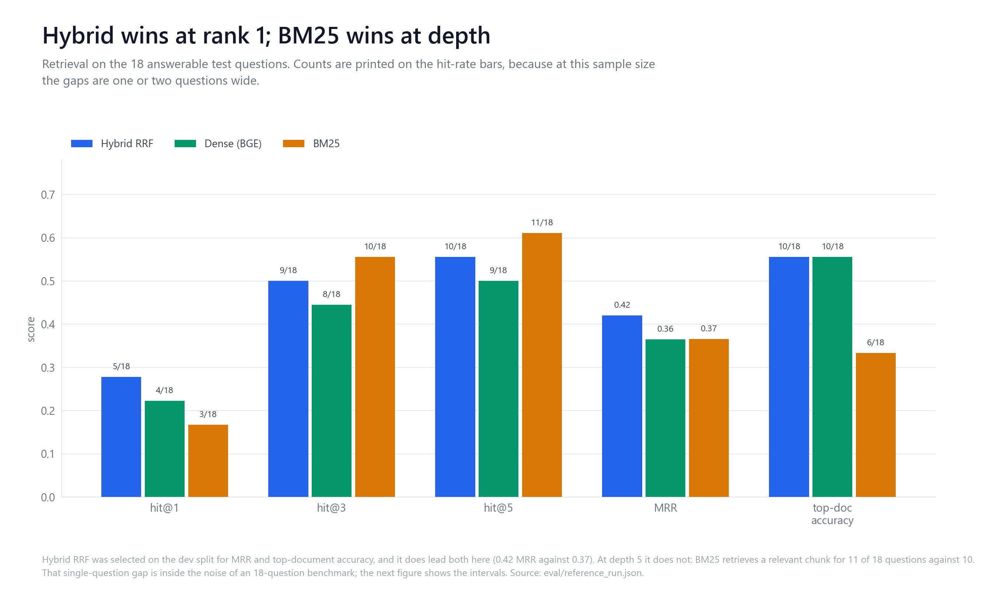
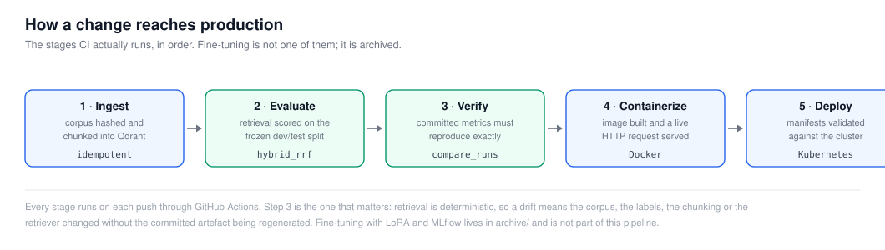
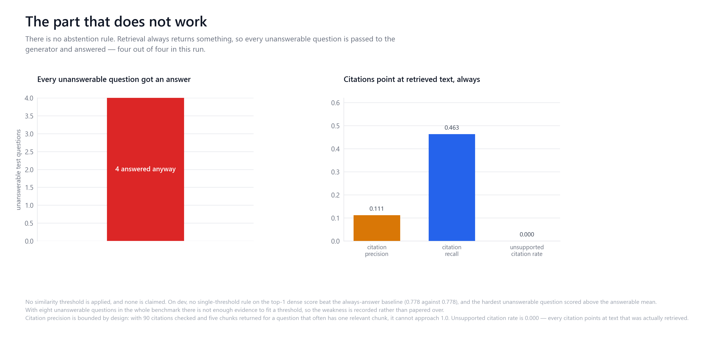
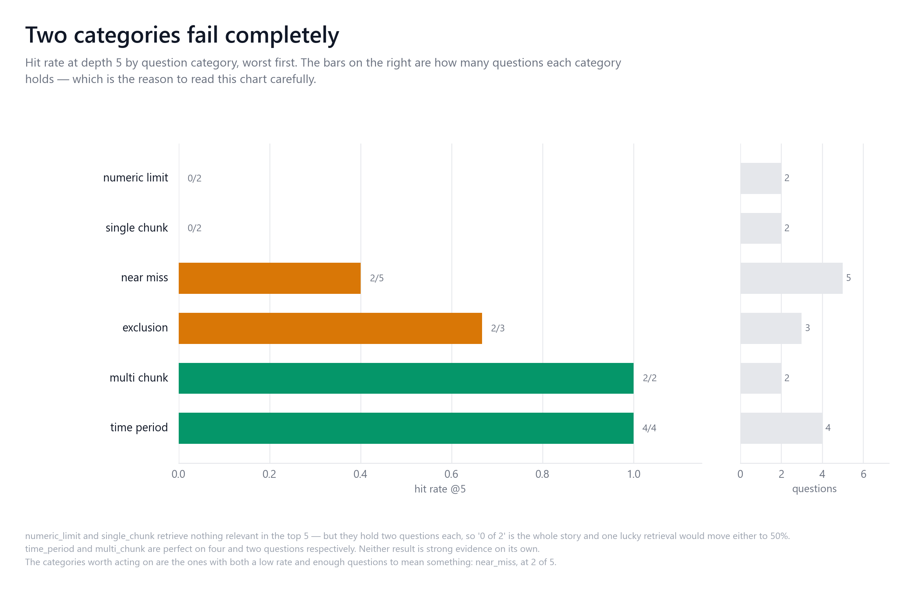

# InsureAssist


-green)

**A retrieval-augmented question-answering service over real insurance policy documents,
built to be measured rather than demonstrated.**

Ask *"What is the Increased Cost of Compliance limit?"* and the service retrieves the
governing passages and answers from them, returning citations that resolve to exact
character offsets in the source regulation.

## Why this benchmark is hard

The corpus is the three **NFIP Standard Flood Insurance Policy** forms — real policy wording,
enacted as federal regulation (44 CFR Part 61) and therefore redistributable.

They are **near-duplicates by design**. All three share a skeleton and much verbatim wording,
but differ in substance: the condominium form has a coinsurance article the others lack; the
$30,000 compliance limit and the 60-day proof-of-loss deadline appear in all three. A
retriever matching on topic finds the right *provision* in the wrong *document*.

That is exactly what the original system did: it returned the correct policy form only
**17%** of the time.

## Measured results — held-out test split

| | Hit@5 | MRR | Top-doc accuracy |
|---|---|---|---|
| Dense only (BGE) | 0.500 | 0.365 | 0.556 |
| BM25 only | **0.611** | 0.366 | 0.333 |
| **Hybrid RRF — selected** | 0.556 | **0.420** | **0.556** |
| *Starting point (dense, 600/100)* | *0.611* | *0.366* | *0.167* |



**Top-document accuracy 0.556**, up 3.3× from 0.167. hit rate@5 0.556 — *not* an improvement
on the original dense baseline's 0.611; BM25 alone still retrieves more relevant chunks.
Scored on the **18 answerable** test questions, so that gap is 11 questions against 10 —
one question, well inside the noise of a benchmark this size.
Full numbers, category breakdown and failure analysis: **[`docs/BENCHMARK.md`](docs/BENCHMARK.md)**.

Everything published is derived from [`eval/reference_run.json`](eval/reference_run.json).
`python -m eval.verify_artifacts` fails if any document drifts from it, and CI runs it.

## Architecture


Every label in that diagram is read from
[`eval/reference_run.json`](eval/reference_run.json), so it describes the system that
produced the published numbers rather than an intended one.

Details in [`docs/ARCHITECTURE.md`](docs/ARCHITECTURE.md).

### How a change reaches production



## Reproduce locally

```bash
pip install -r requirements.txt -r requirements-dev.txt
docker compose up -d qdrant
QDRANT_COLLECTION=nfip_sfip python -m src.ingest
python -m eval.validate_ground_truth
QDRANT_COLLECTION=nfip_sfip python -m eval.reference_run --split test
python -m eval.verify_artifacts
```

For answers, add `ollama pull llama3.2:3b` and `uvicorn src.api:app`.

## Testing and CI

```bash
pytest        # offline: no model, no Qdrant, no network
```

CI runs four jobs: **quality** (lint, corpus checksums, ground-truth validation, doc/artefact
reconciliation, offline tests), **retrieval-eval** (ingests into a real Qdrant, reproduces the
reference run, fails on drift), **container-integration** (builds the image, asserts non-root,
runs live HTTP against a real container), and **manifests**.

CI does not run a language model. Generation quality is therefore not measured in CI.

## Production boundary

`/health` is liveness. `/ready` checks the embedder, the lexical index and the vector store
and returns 503 with per-dependency status. Missing dependencies are 503, never 500; every
response carries a request ID; internal exceptions never reach the caller.

The container is non-root with pinned dependencies and a healthcheck. **Kubernetes manifests
are authored and CI-validated but have never been applied to a cluster**, and the GKE guide is
untested guidance. See [`docs/PRODUCTION.md`](docs/PRODUCTION.md).

## Limitations

- **Unanswerable questions are not detected.** Unanswerable rejection rate is 0.000. No
  similarity threshold is defensible on this data — the hardest trap scores *above* the mean
  for answerable questions. Nothing is claimed.
- **BM25 alone beats the selected hybrid on hit@5.** Hybrid was chosen for MRR and
  top-document accuracy; that trade-off is stated, not hidden.
- **Dev did not generalise**: hybrid scored 1.000 hit@5 on dev, 0.556 on test.
- **No answer-quality metrics.** Only one local model is available and grading its own output
  is circular.
- **One jurisdiction, one peril, three documents.** Results do not transfer.
- **Fine-tuning is archived, not used** — its training data was the old evaluation set. See
  [`archive/README.md`](archive/README.md).



Full list: [`docs/LIMITATIONS.md`](docs/LIMITATIONS.md).

## Figures

All six are generated from [`eval/reference_run.json`](eval/reference_run.json) by one
script, so none of them can disagree with the published result:

```bash
python scripts/figures/generate_figures.py    # the six charts
python scripts/figures/generate_diagrams.py   # architecture and pipeline SVGs
```

| Figure | What it shows |
|---|---|
| [Retrieval scorecard](docs/figures/01_retrieval_scorecard.png) | hybrid against both baselines, with the question count behind every rate |
| [Confidence intervals](docs/figures/02_confidence_intervals.png) | the same numbers with 95% Wilson intervals — they all overlap |
| [By category](docs/figures/03_by_category.png) | where retrieval fails, and how few questions each category holds |
| [Benchmark composition](docs/figures/04_benchmark_composition.png) | the corpus and the 40 questions |
| [Abstention and citations](docs/figures/05_abstention_and_citations.png) | the part that does not work |
| [Chunking sweep](docs/figures/06_chunking_sweep.png) | why the chunks are 800 characters |



`numeric_limit` and `single_chunk` retrieve nothing relevant in the top 5 — but they hold
two questions each, so "0 of 2" is the whole story. The category worth acting on is
`near_miss`, at 2 of 5.

## Evidence

| | |
|---|---|
| Reference run | [`eval/reference_run.json`](eval/reference_run.json) |
| Frozen retrieval config | [`eval/retrieval_config.json`](eval/retrieval_config.json) |
| Ground truth (40 labels) | [`eval/ground_truth/`](eval/ground_truth/) |
| Dev selection evidence | [`eval/dev_comparison.json`](eval/dev_comparison.json), [`eval/dev_chunking_sweep.json`](eval/dev_chunking_sweep.json) |
| Corpus + provenance | [`data/corpus/manifest.json`](data/corpus/manifest.json), [`docs/DATA.md`](docs/DATA.md) |
| Methodology | [`docs/EVALUATION.md`](docs/EVALUATION.md) |

## License

The [MIT License](LICENSE) covers **the code only**. The NFIP forms under `data/corpus/` are
US Government works carrying no copyright (17 U.S.C. 105) and are not relicensed here — see
[`NOTICE`](NOTICE).
